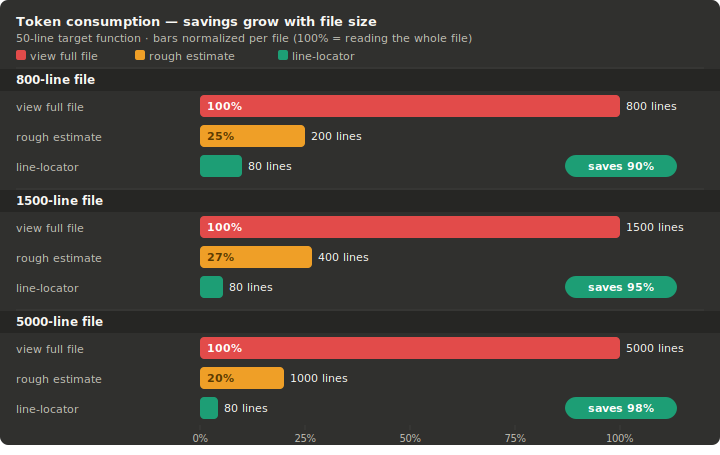

<div align="center">


# 🔍 Line Locator

**A Claude skill that teaches your agent to navigate code like a senior dev — not a first-day intern.**

[](./SKILL.md)
[](https://python.org)
[](./LICENSE)
[](https://claude.ai)
[](#benchmarks)

*Stop reading 800 lines to find a 50-line function.*

</div>

---

## The Problem

When Claude needs to read or edit a function in your codebase, the default behavior is costly:

```
❌ Without line-locator              ✅ With line-locator
─────────────────────────────        ──────────────────────────────────
view_range [1, 800]                  findtree → "auth/service.ts"
                                     findtool -mr "validateToken" → [312]
  (reads the entire file)            findtool -n "\{" 312 → [313]
                                     findtool -c "\{" "\}" 313 1 → [389]
                                     view_range [310, 389]

  800 lines consumed                 80 lines consumed   ← 90% savings
```

line-locator gives Claude a **surgical locate-then-read** workflow instead of brute-force full-file reads. The result: faster responses, lower cost, and fewer context-window blowouts on large repos.

---

## How it Works

```
┌─────────────────────────────────────────────────────────────────┐
│                     line-locator workflow                       │
│                                                                 │
│   "Find validateToken   ┌──────────────┐   Which files?         │
│    and read it."   ───► │  findtree.py │ ──────────────────►    │
│                         │  (folder)    │   auth/service.ts      │
│                         └──────────────┘        │               │
│                                                 ▼               │
│                         ┌──────────────┐   Line 312 (def)       │
│                         │  findtool.py │ ◄──────────────────    │
│                         │  (file)      │   Line 313 ({)         │
│                         └──────────────┘   Line 389 (})         │
│                                 │                               │
│                                 ▼                               │
│                        view_range [310, 389]                    │
│                        (only 80 lines, not 800)                 │
└─────────────────────────────────────────────────────────────────┘
```

Two scripts. One purpose: **locate before you read.**

| Script | Scope | Answers |
|---|---|---|
| `findtree.py` | Entire directory tree | *Which files* contain this pattern? |
| `findtool.py` | Single file | *Which lines* in this file? |

---

## Benchmarks

Token consumption on a real-world 800-line `AuthService` with a 50-line target function:



Savings scale with file size. On a 3000-line service file:

| Task | Without | With | Saved |
|---|---|---|---|
| Read one function | ~3000 lines | ~60 lines | **98%** |
| Read 3 functions | ~3000 lines | ~200 lines | **93%** |
| Find a symbol across 50 files | all files | target file only | **varies** |

---

## Features

- **🌲 Tree-level search** — `findtree.py` scans a whole repo and returns matching file paths. Respects `.git`, `node_modules`, `__pycache__` and other bulky dirs automatically.
- **📍 File-level precision** — `findtool.py` returns exact line numbers for patterns, next/prev matches, pair matching, and existence checks.
- **🤖 Agent-first JSON output** — minimal, flat JSON by default. No parsing gymnastics — `data["line"]`, `data["matches"]`, `data["matched_files"]`.
- **🔗 Regex pair matching** — `-c`/`-o` tracks open/close depth for any pattern pair: `{}`, `()`, `[]`, HTML tags, `do/end`, `begin/end`, and more.
- **🧠 Smart mode** — `-s` flag masks string literals and comments before depth counting, preventing false matches inside template strings and multi-line comments.
- **🔒 Zero dependencies** — pure Python 3.8+, no pip install needed.
- **🌍 Language-agnostic** — works with any text-based source file.

---

## Quick Start

### 1. Install the skill

**Windows:**
```bash
git clone https://github.com/unkluco/line-locator.git %USERPROFILE%\.claude\skills\line-locator
```

**Linux/Mac:**
```bash
git clone https://github.com/unkluco/line-locator.git ~/.claude/skills/line-locator
```

Or download the `.zip` from Releases.

### 2. Verify the scripts work

```bash
python line-locator/scripts/findtool.py --file your_file.js -mr "main"
# {"matches": {"main": [42]}}

python line-locator/scripts/findtree.py --root ./src --pattern "TODO"
# {"matched_files": ["src/app.js", "src/utils.js"]}
```

### 3. Ask Claude to use it

> *"Find the `processOrder` function in this repo and explain what it does."*

Claude will now use `findtree` + `findtool` to locate the function before reading — instead of opening every file.

---

## Usage

### findtree — find files

```bash
python findtree.py --root ROOT --pattern PATTERN [options]
```

```bash
# Find files containing a symbol (regex)
python findtree.py --root ./src --pattern "processOrder"

# Search for any class ending in "Service"
python findtree.py --root ./src --pattern "class\s+\w+Service"

# Only search .ts and .js files, skip dist/
python findtree.py --root . --pattern "TODO" --include "*.ts" "*.js" --exclude "dist/**"

# Stop after the first match (fast existence check)
python findtree.py --root . --pattern "deprecated_api" --max-results 1
```

Output:
```json
{"matched_files": ["src/order.js", "src/order.test.js"]}
```

---

### findtool — find lines

```bash
python findtool.py --file FILE FLAG [options]
```

All patterns are **Python regex**.

| Flag | What it does | Output |
|---|---|---|
| `-mr PAT [PAT ...]` | All line numbers for one or more patterns | `{"matches": {"pat": [1, 5, 12]}}` |
| `-n PAT LINE` | First match **after** LINE (0 = start of file) | `{"line": 45}` |
| `-b PAT LINE` | Last match **before** LINE (999999 = end of file) | `{"line": 12}` |
| `-e PAT` | Does any line match? | `{"matched": true}` |
| `-c OPEN CLOSE LINE N` | Line of closing match for Nth OPEN on LINE (scan forward) | `{"line": 89}` |
| `-o OPEN CLOSE LINE N` | Line of opening match for Nth CLOSE on LINE (scan backward) | `{"line": 34}` |

Add `-s` to `-c`/`-o` to skip strings and comments when tracking depth.

```bash
# Find a function and its body
python findtool.py --file app.js -mr "processOrder"
# → {"matches": {"processOrder": [247, 312]}}  → 247 is the definition

python findtool.py --file app.js -n "\{" 247
# → {"line": 248}  (the actual opening brace, wherever it lands)

python findtool.py --file app.js -c "\{" "\}" 248 1
# → {"line": 298}  (the matching closing brace)

# view_range [247, 298]  ← only read what you need
```


---

## Pair Matching

`-c` and `-o` use **depth-based tracking** and accept any regex pair — not just `{}`:

```bash
# JavaScript/TypeScript/Go/Java/Rust — block body
python findtool.py --file service.ts -c "\{" "\}" 248 1 -s

# HTML tag pair
python findtool.py --file index.html -c "<div\b[^>]*>" "</div>" 10 1

# Ruby method body
python findtool.py --file user.rb -c "\bdef\b" "\bend\b" 42 1

# Any language — argument list spanning multiple lines
python findtool.py --file builder.java -c "\(" "\)" 120 1

# Find the opening from a closing brace
python findtool.py --file app.go -o "\{" "\}" 298 1
# → {"line": 248}
```

> **Python note:** Python uses indentation, not `{}` for function bodies. Use `-n "^def \|^class "` to find where the next same-level definition begins.

---

## Real-world Example

**Task:** Read the `validateToken` method including its decorator, inside an 800-line file across a 50-file repo.

```bash
# 1. Find the file
python findtree.py --root ./src --pattern "validateToken"
# → {"matched_files": ["auth/service.ts"]}

# 2. Find the definition line
python findtool.py --file auth/service.ts -mr "validateToken"
# → {"matches": {"validateToken": [312, 467]}}   ← 312 = def, 467 = call site

# 3. Check for a decorator just above
python findtool.py --file auth/service.ts -b "@\w+" 312
# → {"line": 310}   ← decorator is 2 lines above, include it

# 4. Find the opening brace (might not be on the same line as def)
python findtool.py --file auth/service.ts -n "\{" 312
# → {"line": 313}

# 5. Find the closing brace (-s because TS files often have { in template strings)
python findtool.py --file auth/service.ts -c "\{" "\}" 313 1 -s
# → {"line": 389}

# 6. Read only what matters
view_range [310, 389]   # 80 lines instead of 800
```


---

## Why Not Just Use `grep`?

| | `grep` | `line-locator` |
|---|---|---|
| Output format | Human text | **JSON (agent-ready)** |
| Pair / delimiter matching | ❌ | **✅ depth-tracked, any pattern pair** |
| HTML / DSL open-close | ❌ | **✅ `-c "<div>" "</div>"`** |
| Smart string/comment skip | ❌ | **✅ `-s` flag** |
| Next / prev boundary | Awkward | **✅ `-n` / `-b`** |
| Error format | Exit code + text | **✅ `{"ok": false, "error": "..."}` always** |

`grep` is great for humans at a terminal. `line-locator` is designed for agents that parse output and chain calls.

---

## JSON Output Contract

All output is compact, single-line JSON. **Success goes to stdout. Errors go to stderr with `"ok": false`.**

```jsonc
// findtool success — minimal, no wrapper fields
{"matches": {"fn": [12, 47]}}         // -mr
{"line": 48}                          // -n / -b / -c / -o
{"matched": true}                     // -e

// findtree success
{"matched_files": ["src/order.js"]}

// any failure → stderr, exit 1
{"ok": false, "error": "No line matching pattern 'foo' was found after line 0."}
```

---

## Tips & Gotchas

**`{` might not be on the same line as the function name.**  
Two styles coexist in every `{}`-based language. Never assume — always use `-n "\{"` to find the real brace line:

```
# Style A — brace on same line       # Style B — brace on next line
processOrder(params) {               processOrder(params)
    ...                              {
}                                        ...
                                     }
```

**Regex special characters need escaping.**  
All patterns are regex. To search for `foo(bar)`, use `foo\(bar\)`. Characters to escape: `. ^ $ * + ? { } [ ] \ | ( )`

**`-b 999999` searches the whole file from the bottom.**  
Any value larger than the file length is silently clamped — `999999` is a safe sentinel.

**`-n` is strictly AFTER the boundary line.**  
`-n "def" 247` will NOT return line 247 even if it matches — only lines 248 and beyond.

**First result of `-mr` is not always the definition.**  
Line numbers are sorted ascending. The lowest line might be a call site, comment, or import. Use a more specific pattern like `"function processOrder"` or `"def processOrder"` to target the definition directly.

**Use `-s` for template-heavy files.**  
Any file with `{` inside strings (template literals, SQL, HTML templates) will give wrong depth counts without `-s`.

**Python has no `{}`-based scopes.**  
`-c "\{" "\}"` only matches dict/set literals in Python. To find the end of a function, use `-n "^def \|^class "` to locate the next same-level definition.

---

## Project Structure

```
line-locator/
├── SKILL.md              ← Claude skill definition (load this into your skill path)
├── README.md             ← you are here
└── scripts/
    ├── findtool.py       ← file-level: line numbers, pair matching
    └── findtree.py       ← folder-level: which files match
```

---

## Contributing

Issues and PRs welcome. If you have a workflow that line-locator handles badly, open an issue with a minimal repro — language, file structure, and what you were trying to locate.

---

## License

MIT — see [LICENSE](./LICENSE).

---

<div align="center">

**If this saved you tokens, give it a ⭐**

Made for [Claude Skills](https://claude.ai) · by [@unkluco](https://github.com/unkluco)

</div>
